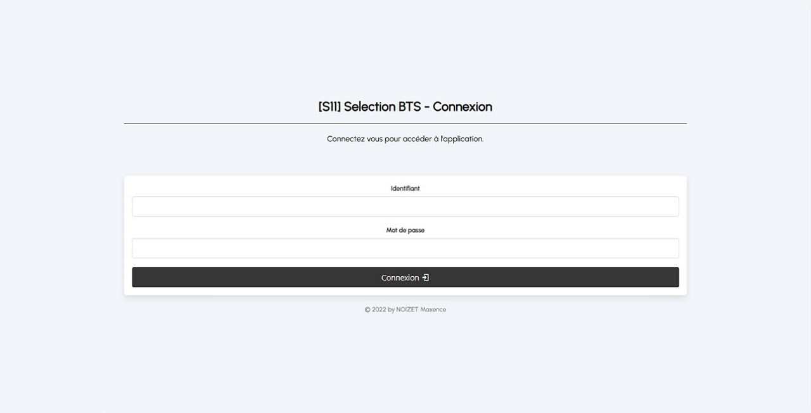
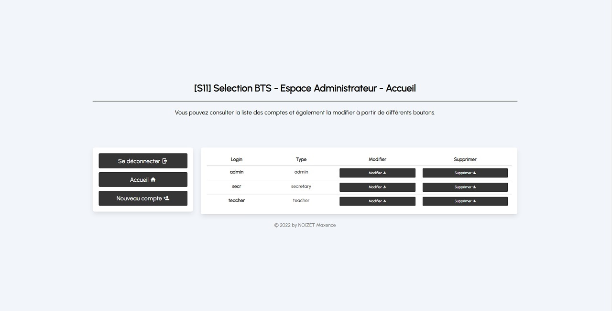
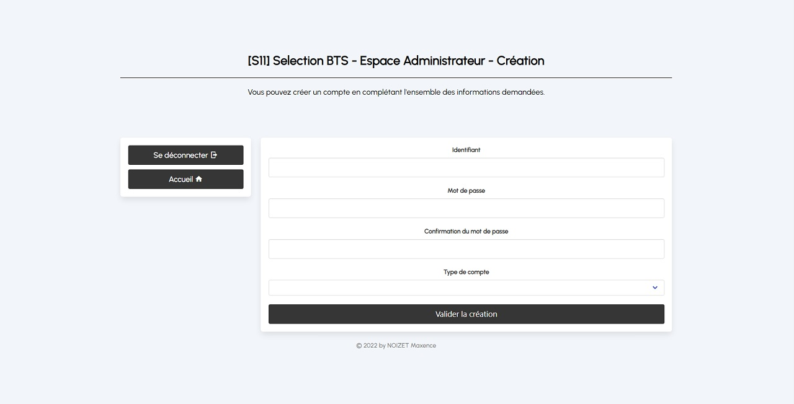

# [S11] SELECTION BTS

   <a href="https://github.com/25thMaxouuu/s11-selection"><a>
   <a href="https://php.net/"><a>
   <a href="https://bulma.io/"><a>

French version **[here](https://github.com/25thMaxouuu/s11-selection/blob/main/docs/README-FR.md)**.

## Description

S11 Selection is a PHP web solution designed to automate the creation of a student's evaluation grid and then gather them to make a ranking. This application is an individual school project done during my first year.

## Setup

> PHP 8 or higher is required !

A ready-to-import database template is available in `./docs/selection.sql`. The 3 accounts are `admin@admin` & `teacher@teacher` & `secr@secr`.\
Then duplicate the file named `.env.template` and rename it `.env`. Then fill in the values with your personal data.

The application is then ready to use.

## Features

1. Authentication portal ;
2. Evaluator's area :
   1. Filling in an evaluation grid,
   2. Update a grid,
   3. View the ranking,
3. Secretary's area :
   1. View and download the ranking in CSV format,
4. Administrator area :
   1. Create an account,
   2. Update an account,
   3. Delete an account.

## Pictures

### Authentication page

   

### Home page example

   

### Form example

   

## Technical characteristics

:computer: Object-oriented PHP under MVC architecture.\
:pencil2: Use of **[Bulma](https://bulma.io/documentation/overview/start/)** CSS framework.\
:arrow_forward: App icon from **[Icons8](https://icons8.com/icon/64044/grid)**.

## About

Project carried out from early October 2020 to early December 2020. Project reworked from 9 December 2021 for my exams.

Created by **NOIZET Maxence** **<noizetmaxencepro@gmail.com>**.\
Project under the **[MIT License](https://opensource.org/licenses/MIT)**.
